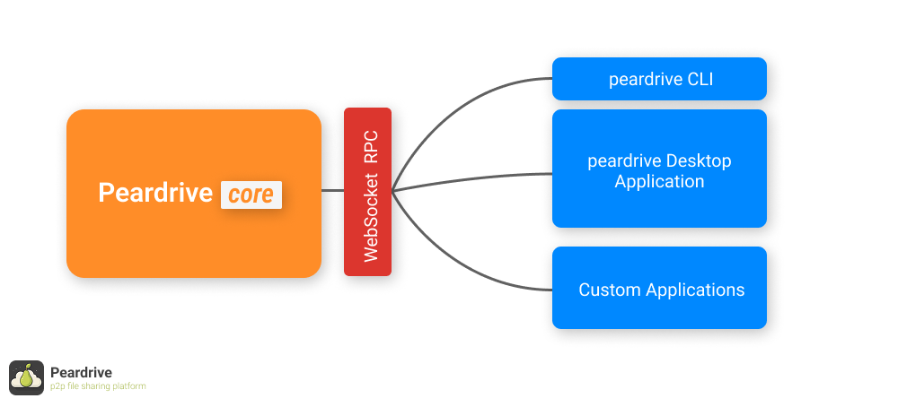

# PearCore




**pearcore** is a fully decentralized, peer-to-peer file-sharing network built for reliability, resilience, and ease of use.

**PearCore** is the foundation of the pearcore ecosystem. It enables you to spin up bootstrap nodes, operate lightweight daemons, manage cryptographic identities, and seamlessly join or host file swarms. all accessible through a streamlined CLI or a powerful WebSocket-based RPC interface.

<br>

## Installation guide

Follow these steps to set up **pearcore-core** locally and enable the `pearcore` CLI command.

### 1. Clone the repository
```bash
git clone https://github.com/Prototype-Drive/pearcore.git
cd pearcore
```

### 2. Install dependencies
```bash
npm install
```

### 3. Run the test suite

Before linking the CLI, make sure everything is functioning correctly by running the full test suite.

```bash
npm test
```
**PearCore** uses Vitest unit testing. running the tests ensures that all core modules like RPC, swarm management, identity, daemon logic, and CLI commands are behaving as expected.

### 4. Link the CLI globally
This makes the `pearcore` command available system-wide.
```bash
npm link
```

You're all set! 🎉  
Run `pearcore --help` to verify the CLI is working.

<br>

## Documents

If you have followed the installation guide, the `pearcore` CLI interface is now available on your system.
For a complete details on the project, APIs and commands please visit [`doc/` folder](./docs/)

## 📜 License

MIT License
