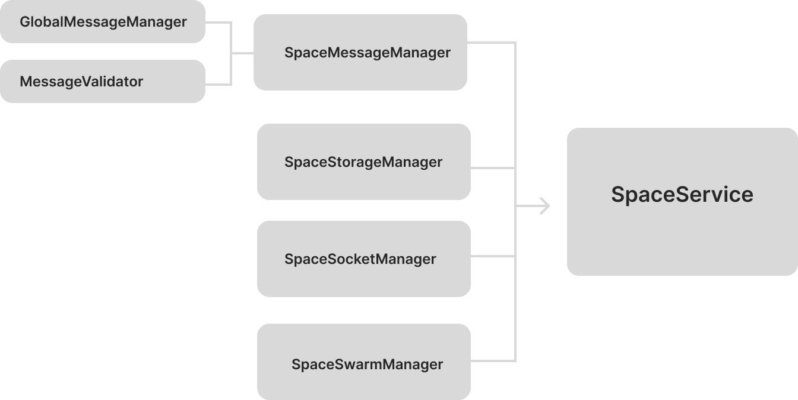

<h1>Space Service: Manager Architecture</h1>

- [Overview](#overview)
- [The Four Managers](#the-four-managers)
  - [1. SpaceSwarmManager](#1-spaceswarmmanager)
  - [2. SpaceStorageManager](#2-spacestoragemanager)
  - [3. SpaceMessageManager](#3-spacemessagemanager)
  - [4. SpaceSocketManager](#4-spacesocketmanager)
- [Key Workflows](#key-workflows)
  - [Space Creation](#space-creation)
  - [Joining a Space](#joining-a-space)
  - [Message Flow](#message-flow)
  - [Peer Connection Handling](#peer-connection-handling)
- [State Management](#state-management)
- [Design Principles](#design-principles)
- [Dependencies Map](#dependencies-map)

## Overview


**SpaceService** merges four specialized managers to handle P2P space operations. Each manager has a distinct responsibility and minimal dependencies.

## The Four Managers

### 1. SpaceSwarmManager
**Purpose**: Handles P2P network connections
- Creates and joins Hyperswarm topics for each space
- Manages peer discovery via DHT
- Handles connection lifecycle (start/stop)

**Dependencies**: 
- `network.utils.js` (`connectSwarm`, `joinSwarmTopic`)

**Key Point**: This manager knows nothing about spaces or messages—only about P2P networking.

### 2. SpaceStorageManager
**Purpose**: Manages space metadata and share links
- Creates spaces with cryptographic signatures
- Generates/decodes shareable invitation links
- Stores/retrieves space data from database
- Maps spaces to deterministic topic hashes

**Dependencies**:
- `space.utils.js` (`generateSpaceTopic`, `createSpaceForPublicKey`, etc.)
- `sharelink.utils.js` (`createShareLink`, `decodeShareLink`)

### 3. SpaceMessageManager
**Purpose**: Handles all message processing within spaces
- Validates message signatures and formats
- Routes messages to appropriate handlers
- Enforces space permissions (read/broadcast whitelists)
- Requests/responds to space metadata

**Inherits from**: `GlobalMessageManager` (base message handling)

**Dependencies**:
- `protocol.utils.js` (message creation)
- `profile.utils.js` (profile operations)
- `parsers.utils.js` (topic parsing)

**Note**: Uses `MessageValidator` class for all validation logic

### 4. SpaceSocketManager
**Purpose**: Tracks connections between sockets, peers, and topics
- Maintains three-way mapping: `Socket ↔ Peer ↔ Topic`
- Manages join queue (spaces being joined)
- Provides lookup methods for connection state
- Parses topic hashes to readable metadata

**Dependencies**:
- `parsers.utils.js` (`parseSpaceTopic`)

## Key Workflows

### Space Creation
1. User calls `createSpace()` → SpaceService calls `SpaceStorageManager.createSpace()`
2. StorageManager generates: topic hash, cryptographic signature, share link
3. SwarmManager joins the P2P topic asynchronously
4. SocketManager registers the topic for connection tracking

### Joining a Space
1. User provides share link → `joinSpace()` decodes it
2. Topic added to SocketManager's join queue
3. SwarmManager joins topic, SocketManager tracks it
4. MessageManager requests metadata from connected peers

### Message Flow
1. Socket receives data → SpaceService passes to MessageManager
2. GlobalMessageManager validates signature/format
3. MessageManager routes to handler based on type:
   - `ProfileUpdate`: Updates user profiles
   - `SpaceMetadata`: Syncs space metadata between peers
4. MessageValidator checks permissions and timestamps

### Peer Connection Handling
1. New peer connects → SwarmManager triggers `swarmConnectionHandler`
2. SocketManager tracks the socket-peer-topic relationships
3. MessageManager requests metadata for spaces in join queue
4. Socket event handlers attached for data/close/error/timeout

## State Management
`getState()` provides real-time connection snapshot:
- Topics and join queue (from SocketManager)
- Peer↔topic mappings
- Manager initialization status

## Design Principles

1. **Single Responsibility**: Each manager does one thing well
2. **Utility-First Dependencies**: Managers only depend on utility functions
3. **Event-Driven**: Sockets emit events, managers provide synchronous APIs
4. **Graceful Degradation**: Individual failures don't break the whole system
5. **Clear Lifecycle**: Two-phase initialization (construct → start)

## Dependencies Map
```
SpaceService
├── SpaceSwarmManager → network.utils.js
├── SpaceStorageManager → space.utils.js + sharelink.utils.js
├── SpaceMessageManager → protocol.utils.js + profile.utils.js + parsers.utils.js
└── SpaceSocketManager → parsers.utils.js
```

This architecture allows swapping any layer (e.g., P2P library, database) by updating only the utility functions, keeping managers and services unchanged.