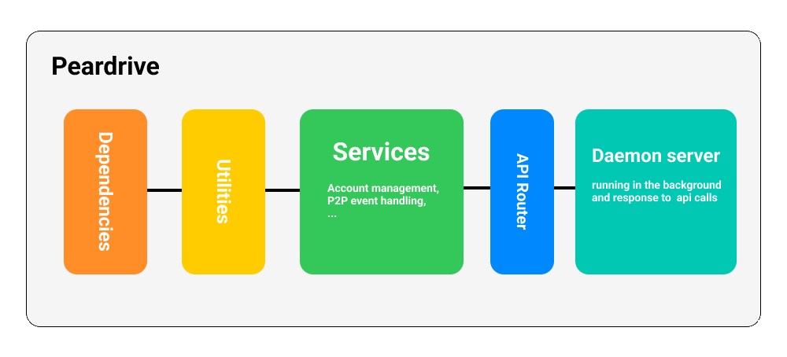
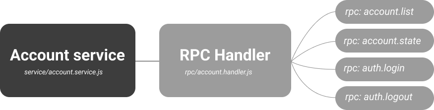
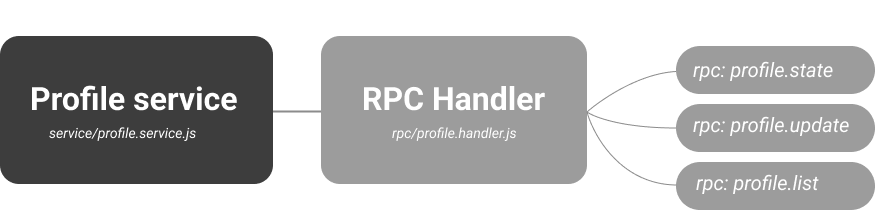
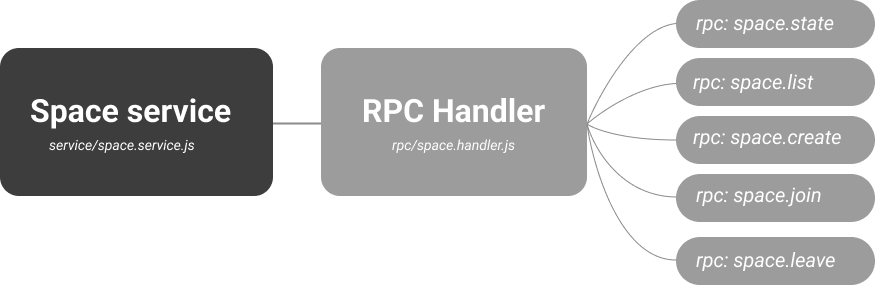

<h1> Peardrive Architecture Documentation </h1>

- [System Overview](#system-overview)
- [Architectural Layers](#architectural-layers)
  - [1. Utility Layer (`utils/`)](#1-utility-layer-utils)
  - [2. Service Layer (`services/`)](#2-service-layer-services)
    - [2.1 Account Service (`account.service.js`)](#21-account-service-accountservicejs)
    - [2.2 Profile Service (`profile.service.js`)](#22-profile-service-profileservicejs)
    - [2.3 Session Service (`session.service.js`)](#23-session-service-sessionservicejs)
    - [2.4 Space Service (`space.service.js`)](#24-space-service-spaceservicejs)
  - [3. RPC Layer (`rpc/`)](#3-rpc-layer-rpc)
  - [4. Integration Point (`daemon.js`)](#4-integration-point-daemonjs)
- [Data Flow](#data-flow)
  - [Request Path](#request-path)
  - [Example: `space.join` Request](#example-spacejoin-request)
- [Dependencies Graph](#dependencies-graph)
- [Key Design Decisions](#key-design-decisions)
- [Module Relationships](#module-relationships)


## System Overview


Peardrive is a peer-to-peer platform for messaging and file sharing within dedicated spaces. The architecture follows a layered approach with clear separation between utilities, business logic, and API interfaces. Communication with client applications occurs via WebSocket RPC calls.

## Architectural Layers

### 1. Utility Layer (`utils/`)
The utility layer serves as the foundational bedrock upon which the entire Peardrive architecture rests. Each utility module encapsulates a specific set of runtime-dependent operations, acting as an abstraction layer between the Node.js runtime APIs and the application's business logic.

They are strategic isolation points where all environment-specific operations are concentrated. When `crypto.utils.js` performs encryption, it's not just encrypting data, it's providing the only encryption interface the entire application may use. When `system.utils.js` interacts with the filesystem, it's establishing the sole contract for file operations across the entire codebase.

This architectural decision creates a critical boundary: all services above this layer must treat these utilities as their exclusive gateway to the underlying runtime. The `account.service.js` doesn't know whether it's running on Node.js, Bun, or a bare environment, it only knows it can call `deriveKeyFromPassword()` from `crypto.utils.js` and receive a predictable result.

The runtime-portability strategy is straightforward: if we need to migrate from Node.js to another JavaScript runtime, we only need to ensure these utility modules continue to fulfill their contracts. The services, handlers, and daemon remain untouched because they never interact directly with `fs`, `crypto`, or `net` modules, they only interact with our abstraction layer.

<br>

### 2. Service Layer (`services/`)
Business logic components that consume utilities:

---
#### 2.1 Account Service (`account.service.js`)


**Function**: Account lifecycle management and authentication

**Utilities used**: 
- `crypto.utils.js` (deriveKeyFromPassword, decryptJSON, fromBase64)
- `accounts.utils.js` (accountBaseDir, listAccountsWithMeta, createAccountUtility, readAccountMeta)
- `system.utils.js` (fileExistsSync, pathJoin, readFile)
- `database/database.js` (loadAccountDatabase)

**RPC endpoints served**:
- `account.list`
- `account.create`
- `auth.login`
- `auth.logout`

---

#### 2.2 Profile Service (`profile.service.js`)


**Function**: User profile management

**Utilities used**:
- `profile.utils.js` (getAllProfiles, getProfileByPublicKey, createProfileForPublicKey)

**RPC endpoints served**:
- `profile.list`
- `profile.state`
- `profile.update`

---

#### 2.3 Session Service (`session.service.js`)
**Function**: Internal session state management

**Dependencies**: Minimal (logger only, currently unused)

**RPC exposure**: Internal use only

---

#### 2.4 Space Service (`space.service.js`)


**Function**: Space management with four subcomponents:

> for more information please visit [space-service.md](./space-service.md)

**SpaceSwarmManager**
- Handles P2P swarm connections
- **Utilities used**: `network.utils.js` (connectSwarm, joinSwarmTopic)

**SpaceStorageManager**
- Manages space metadata and share links
- **Utilities used**: 
  - `space.utils.js` (generateSpaceTopic, createSpaceForPublicKey, upsertSpace, listSpaces, querySpace, getSpace)
  - `sharelink.utils.js` (createShareLink, decodeShareLink)

**SpaceMessageManager**
- Handles messaging and validation
- **Utilities used**:
  - `protocol.utils.js` (createProfileUpdateMessage, createSpaceSyncMessage)
  - `profile.utils.js` (getProfileByPublicKey, createProfileForPublicKey, upsertVerifiedUserProfile)
  - `parsers.utils.js` (parseSpaceTopic)
  - `crypto.utils.js` (hex)

**SpaceSocketManager**
- Manages WebSocket connections for spaces

**RPC endpoints served**:
- `space.state`
- `space.list`
- `space.create`
- `space.join`
- `space.leave`
---

<br>

### 3. RPC Layer (`rpc/`)
**Function**: Routes WebSocket messages to appropriate handlers
**Structure**:
- Individual handler files (`<name>.handler.js`)
- Central router (`route.js`) that maps RPC methods to handlers
- Handlers call corresponding service methods

<br>

### 4. Integration Point (`daemon.js`)
**Function**: WebSocket server implementation
- Initializes services
- Sets up WebSocket connection handling
- Routes incoming messages through RPC layer

## Data Flow

### Request Path
```
WebSocket Client → daemon.js → rpc/route.js → rpc/<name>.handler.js → services/<name>.service.js → utils/
```

### Example: `space.join` Request
1. Client sends WebSocket message: `{method: "space.join", params: {...}}`
2. `daemon.js` receives message, passes to `rpc/route.js`
3. Router identifies `space.handler.js` as target
4. Handler calls `space.service.js` join method
5. SpaceService coordinates:
   - `SpaceSwarmManager.join()` → uses `network.utils.js`
   - `SpaceStorageManager.recordJoin()` → uses `space.utils.js`
   - `SpaceMessageManager.announceJoin()` → uses `protocol.utils.js`
6. Response propagates back through chain to client

## Dependencies Graph
```
utils/ 
  ├── crypto.utils.js
  ├── accounts.utils.js
  ├── profile.utils.js
  ├── network.utils.js
  ├── space.utils.js
  └── ...
    ↓
services/
  ├── account.service.js
  ├── profile.service.js
  └── space.service.js
    ↓
rpc/
  ├── account.handler.js
  ├── profile.handler.js
  └── space.handler.js
    ↓
daemon.js
```

## Key Design Decisions

1. **Utility isolation**: All low-level operations encapsulated in utility modules
2. **Service encapsulation**: Business logic contained in services with clear dependencies
3. **API separation**: RPC layer provides clean interface between services and WebSocket API
4. **Space decomposition**: Space functionality divided into four focused managers
5. **Explicit dependencies**: Each module explicitly imports required utilities

## Module Relationships

- Services depend only on utilities, not on each other
- RPC handlers depend on specific services
- Utility modules have no dependencies on services or handlers
- `daemon.js` initializes the entire dependency tree

This architecture enables:
- Independent testing of utility modules
- Service development without WebSocket concerns
- Clear separation between protocol logic and business logic
- Scalable addition of new RPC endpoints without modifying services